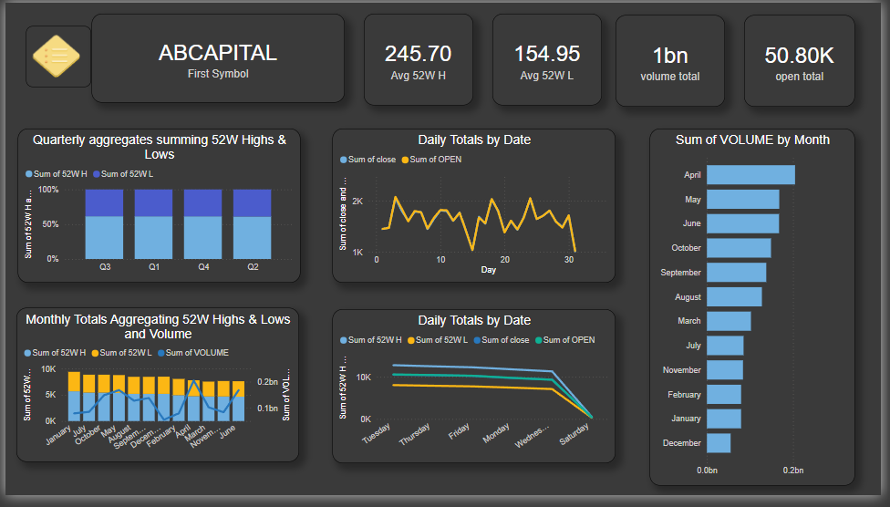

# Stock-Market-Analysis-Dashboard
# Stock Market Data Analysis & Dashboard 📊

This project showcases a one-year **Stock Market Data Analysis** using Python and Power BI. The goal was to extract, process, and visualize NSE stock data for better insights into market trends.
## 📸 Dashboard Preview

## 📌 Features

- Web scraped daily stock data for **522 companies** from the **NSE website** using Python.
- Combined and cleaned the data into a single `.csv` file.
- Built an **interactive Power BI dashboard** featuring:
  - High and Low prices per stock
  - Quarterly aggregates of high/low values
  - Monthly total trading volumes
  - Daily total market activity
  - **Navigation button to filter and explore individual stocks**

## 🛠 Tools Used

- Python (requests, pandas, BeautifulSoup)
- Power BI (Power Query Editor, Visualizations)

